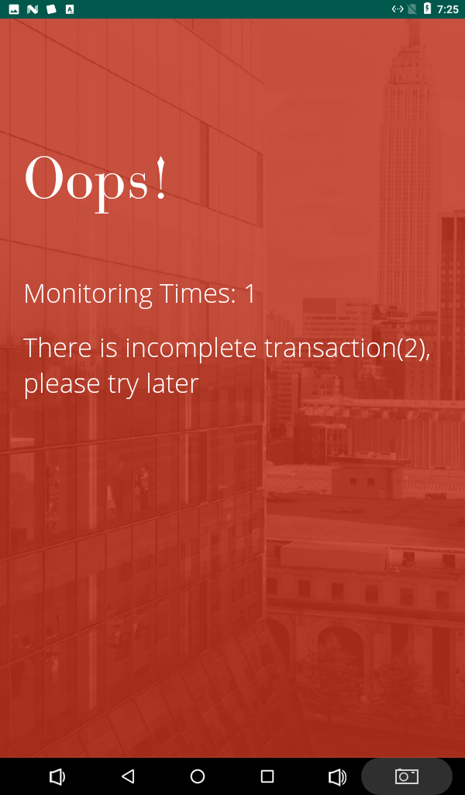

# Payment App FAQ

>  This document is still writing now, if there is something missed, feel free to raise an issue or make a pull request to contribute this doc together.
>
> Thanks.

## Terms Define

| term                  | description                                                  |
| --------------------- | ------------------------------------------------------------ |
| **POS Terminal**      | Point of Sale Terminal, in this article, actually is IDTech VP3300 only.<br/>It's reponsible for Swipe/Tap/Insert Card Detection and process the subsequently transactions. |
| **WorldNet**          | **WorldNet** is a payment gateway, which is popular in USA market. |
| **WorldNet SDK**      | Software Development Kit by **WorldNet**, it's responsible for POS Terminal interaction.<br/>e.g.,<br/>1. Init POS Terminal<br/>2. Setup POS Terminal<br/>3. Read Bankcard and process transaction |
| **Android Tablet**    | Android Tablet for run **Payment App**, it's just a runtime enviroment for **Payment App**.<br/>It exposed 2 port for IT stuff only<br/>1. Ethernet socket<br/>2. Power socket<br/>The port below is masked by panel<br/>1. microUSB port to IDTech VP3300<br/>2. |
| **Payment App**       | Android Tablet **Payment App**, which our developing and released.<br/>1. Payment App doesn't communicate with POS Terminal directly but use it by call **WorldNet SDK** API.<br/>2. Bank card detect ability is not our business but **WorldNet** and **IDTech** buesiness.<br/> |
| **Venus**             | Local server hardware, which run a lot of service such as **misClient**, etc...<br/>Venus usualy insatlled on roof of cabinets, is hard to see for customers. |
| **misClient**         | A local service run in every **Venus**, which is interact with cabinets hardware, **Payment App** and **VMS**. It's bind to cabinets, every cabinet has it's own **Venus**<br/>It's responsible for hardware controling such as Lock, Light, temperature sensor, etc. <br/>More importantly, It interact with payment app, response create order request, open-door request, shopping cart request and so on.<br/>It interact with VMS too, such as device info upload, forward transaction info to **VMS** and so on. |
| **App Update Server** | A standlone service run in remote server, which is responsible for app update chekcing, app downloading and so on.<br/>**AppUpdateServer**'s URI is http://app.sandstar.com:7070 |
| **VMS**               | Vending Machine System which developed by SandStar. You can login it by VMS portal URL.<br/>**VMS** interact with **misClient** only, it's not interact with **Payment App** directly. |


## User Guide

### 1. POS Initialization Screen

#### Screenshot


#### Description

>  IDTech VP3300 POS is initializing.

This screen usually does not take a long time. In our test environment  usually need 30 sec around.

In this phase, payment app only communicate with the payment gateway(actually is **WorldNet**) and will move to the next screen(Welcome Screen) as long as **POS terminal** which is IDTech VP3300 was setup successful.

> BTW: IDTech VP3300 setup process is not our code but WorldNet SDK's code, so how long time POS initializing  spend is up to WorldNet.

If the initialization is not successful within 60 seconds, the payment app will auto-restart and re-initialize.

<span style="color:red">If the payment app restarts repeatedly at this screen, check the connectivity of the tablet and the Internet. There are breif guide to checking below<span/>

1. Check the LAN cabinet is working well.

2. Check the WAN connectivity is working well.

   

### 2. Welcome Screen

#### Screenshot


#### Description

> Welcome screen is waiting for touch.

In this screen, you can do nothing but touch the screen, when you touch the screen, it will move to next screen quickly.

> BTW: payment app update chekcing is run in this screen slient.

If there have a new apk was released to **AppUpdateServer**. The **payment app** will download the new apk quickly and then install it on tablet automatically. Once the newest apk was installed,tablet will auto-restart the newest app in seconds.

### 3. Prepare Transaction Screen

#### Screenshot


#### Description

> Transaction is preparing.

In this screen, **payment app** will request the `/sync/getPreAuthAmount` endpoint from **misClient** server which is run in Venus to fetch the `preOrderAmount` and `orderCode` fields, which will be used to perform next call. 

Once the **payment app** received the response from **misClient** and get the `preOrderAmount` and `orderCode` params, it will instantly to perform a `processSalce` call by **WorldNet SDK**  to active the **POS Terminal**, then the light of **POS Terminal** will be green. and the will switched to next screen(ScanCardScreen).

!> Know Issues


If there is "Count not get advance order information" occurred, it's means the **misClient** not response as **Payment App** expected.

So please check below :

1. Is **misClient** Server running ?
2. Is VMSClient IP which in **Payment App**'s' Config Screen  is configured correcttly ?


### 4. Scan Card Screen

#### Screenshot


#### Description

> Waiting customer show card.

At first, the Tap/Insert/Swipe mode is activated, so customer can present their bankcard with **POS Terminal**(IDTech VP3300) built-in card interface.

Once **POS Terminal** detected the bankcard, **payment app** will toast a message like below.


!> Know Issues

If the card is not supported by **WorldNet** or **POS Terminal**, **payment app** will toast a error meesage like below.

| Card tap not supported, please use intert or swipe mode.     | Card expired, please use another card.                      |
| ------------------------------------------------------------ | ----------------------------------------------------------- |
|  |  |

If the card detected is well, the **payment app** will request `/sync/openDoor`  from **misClient**, once **misClient** response success to **payment app**,then the screen will be switched to **Door Unlocked Screen**.

### 5. Door Unlocked Screen

#### Screenshot


#### Description

> Waiting customer open the door.

The door lock will remain open for about ten seconds, and if the door is pulled within the lock open time period, then shopping can begin; if the door is opened too late, the lock will automatically fall down.

!> Know Issues

If `/sync/openDoor` request is not working, the **payment app** will switch to the error screen. You can found it in [Opps Screen Secion](#_8-Oops-Screen)

### 6. Shopping Screen

#### Screenshot

| Empty Shopping Cart                                       | Shopping Cart                                              |
| --------------------------------------------------------- | ---------------------------------------------------------- |
|  |  |

#### Description

During open-door shopping, the shopping cart page will automatically update when you take any item out of the cabinet.

!> Potential Issues

1. If an item is incorrectly identified, such as recognizing a Coke as a cookie, please contact the vision algorithm team.
2. If the item is incorrectly priced, please contact IT support. 

### 7. Checkout Screen

#### Screenshot


#### Description

When the cabinet door is closed, **payment app** automatically switches to the checkout screen and stays there for a few seconds.

The customer can check the amount of his purchase on this page and this amount will be charged to his credit card shortly afterwards.

!> Potential Issues

1. If the purchase amount is incorrect, please contact IT support

### 8. Oops Screen

#### Screenshot



#### Description

The **payment app** will switch to the error screen like above while any exception happened during shopping. 

> The key point in this screen is the error message presented.So please record this message that IT support can locate the problem as soon as possible.

**Common Error Message Table**

| Error Message                                        | Description                                                  |
| ---------------------------------------------------- | ------------------------------------------------------------ |
| There is incomplete transaction(2), please try later | There is a incomplete transaction, please wait a minute.<br/>If this message repeat persists, please call IT support. |
| System Error(3), please try later                    | Hardware communication failed, please call IT support.       |
| System Error(4), please try later                    | Algorithm communication failed, please call IT support.      |
| System Error(5), please try later                    | Serial port equipment not ready, please call IT support.     |
| System Error(6), please try later                    | There was a problem with the scanner. Please try again later or contact our service team for help. |
| System Error(9), please try later                    | The service is not ready, please call IT support.            |
| Other problems.                                      | Please take a photo and call IT support.                     |


## Technician Guide

### 1.  How to login Venus

> You must connect to the cabinets VPN before login venus.

```shell
ssh sandstart@10.9.x.x
```

### 2. How to get the IP of Tablet

> **Payment App** will enabled the remote debug ability automatically when it was launched, the remote connect port is 5555.

Actually, the **Payment App** will auto-lauch when **Tablet** power-on. But how to acquired the IP of tablet is required some work to do in this situation.

We can use the command like below to scan the LAN in order to detected the tablet's IP.

#### Preparetion

1. Make sure the Venus has `ip` and `nmap` and `adb` command, if the answer is not, please use `sudo apt install nmap adb` to install it directly.
2. Make sure the Venus and Tablets power-on and connect to same LAN. 
3. Use `ip` command to fetch the LAN IP of Venus like below, the `10.81.110.217` is the IP of Venus.

```shell
ip addr|grep eth0 -A 10
```


#### Scan Tablet's IP

Now, we have the ethernet IP(LAN) of Venus, it's a good begin. secondly, we need to use `nmap` command to scan the tablet's IP.

In this demonstrate, we use `10.81.110.0/24` subnet to scan it.

```shell
nmap 10.81.110.0/24 -p5555 |grep open  -B 5
```


The figure above show two IP with 5555 port opened in this subnet, means there are two Tablet avaliable.

### 3. How to check the log of payment app

#### Preparetion

Firstly, connect the tablet with command below.

```shell
adb connect 10.81.110.182
```


Secondly, check the android device with command below.

```shell
adb devices
```


#### Read Tablet logs

If every thing is fine, you can use the command below to read the realtime logs of Tablet.

```shell
adb logcat
```


#### Read Tablet logs Advance

The filter is supported. You can use `pipe` and  `grep` command to filter the log of Tablet like below.

```shell
# Read POS logs only
adb logcat |grep PosManager
# Read Exception logs only
adb logcat |grep Exception
```

#### One more thing

Since the `adb` command is avaliable, you can use all `adb` functions to control the **Tablet** and **Payment App**.

```shell
# ssh to Tablet
adb shell
# Kill the payment-app
adb shell am force-stop com.yitunnel.creditcard
# Start the payment-app
adb shell am start -n com.yitunnel.creditcard/com.sandstar.ui.InitPaymentActivity
```

If you want to see more detail of `adb` command, please visit this site below, which is provide by Google.

https://developer.android.com/studio/command-line/adb
